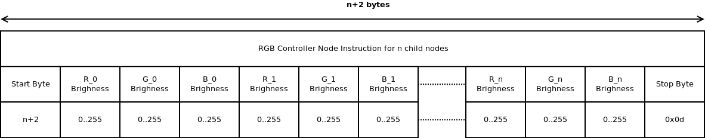

#Milestone 1: Communicating with Will Byers

## UART Controlled RGB LED Nodes

### Author
Julia Konstantinos and John McAvoy

### Last Updated
19 Oct 2018

### Files
* [main.c](./src/main.c)
* [rgb_duty_cycle.h](./src/rgb_duty_cycle.h)
* [rgb_duty_cycle.c](./src/rgb_duty_cycle.c)
* [uart.h](./src/uart.h)
* [uart.c](./src/uart.c)

### Building
Building using msp430-gcc:
`$ make`

The code can also be built using Building using TI compiler, import the source code into Code Composer Studio and compile.

### Uploading the Code
After building using `make`, a binary file [msp430g2553_milestone_1.elf](./bin/msp430g2553_milestone_1.elf) can be uploaded to your G2553 processor. If [mspdebug](https://github.com/dlbeer/mspdebug) is installed, you can run:

`$ make run`

to quickly upload the binary for debugging.

#### Usage
Setup

UART format

#### Examples

|               Function            |           UART Message         |
|-----------------------------------|--------------------------------|
|Set LED0 red                       |05 ff 00 00 0d                  |
|Set LED0 green                     |05 00 ff 00 0d                  |
|Set LED0 blue                      |05 00 00 ff 0d                  |
|Set LED0 purple                    |05 ff 00 ff 0d                  |
|Set LED0 white                     |05 ff ff ff 0d                  |
|Set LED0 dim white                 |05 0f 0f 0f 0d                  |
|Set LED0 red, LED1 green, LED2 blue|10 ff 00 00 00 ff 00 00 00 ff 0d|
